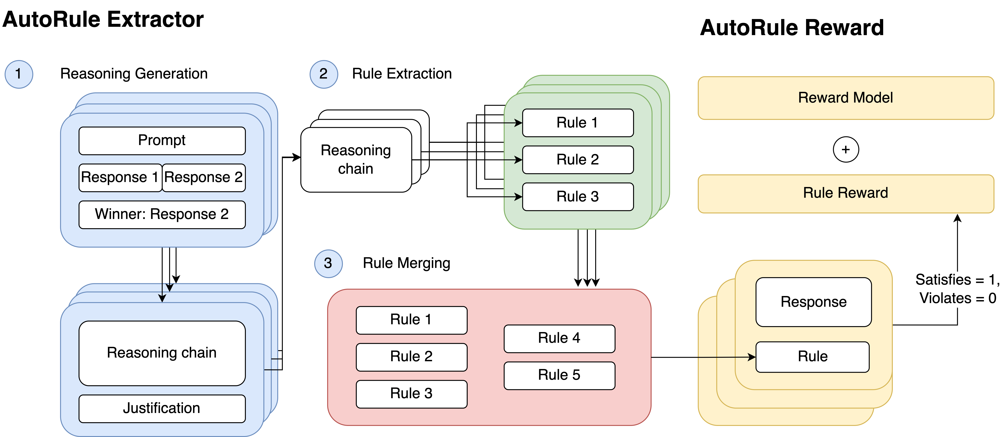

# AutoRule Extractor

This is a custom-modified version of **AutoRule: Reasoning Chain-of-thought Extracted Rule-based Rewards Improve Preference Learning**. [Arxiv](https://arxiv.org/abs/2506.15651)

*This fork allows Gemini backend for rule extraction, allowing easier integration*

See [Original GitHub Repo](https://github.com/cxcscmu/AutoRule).




## Setup

Install dependencies for dataset preprocessing and rule extraction:
```bash
pip install -r requirements.txt
```

Add your HuggingFace token to download the required UltraFeedback-binarized and MT-Bench Human Judgement datasets:
```bash
huggingface-cli login
```

To extract rules with the authors' scripts, you also need access to an LLM backend; currently, AWS Bedrock and Google Gemini are supported.

If you choose Amazon Bedrock. Set the following environment variables:
```bash
AWS_ACCESS_KEY_ID=<YOUR_KEY>
AWS_SECRET_ACCESS_KEY=<YOUR_KEY>
```

If you choose Google Gemini. Set the following environment variables:
```bash
GEMINI_API_KEY=<YOUR_KEY>
```

Rename `.env.exmaple` to `.env` to include them with convenience.

## AutoRule Extraction

Extract rules from preference data using:
```bash
python src/autorule.py --dataset_type <uf|mt> --llm_provider=<gemini|bedrock> --output_dir <output_directory>
```

**Arguments:**
- `dataset_type` - Choose `uf` (UltraFeedback) or `mt` (MT-Bench)
- `output_dir` - Directory to save the extracted rules
- `uf_num_examples` - Number of examples for rule extraction from UF dataset (default: 256)
- `mt_num_examples_per_question` - Number of examples per MT query for rule extraction (default: 8)
- `num_proc` - Number of processes for parallel evaluation (default: 8)
- `llm_provider` - The LLM backend, choose `gemini` for Google Gemini or `bedrock` for the original AWS Bedrock.
